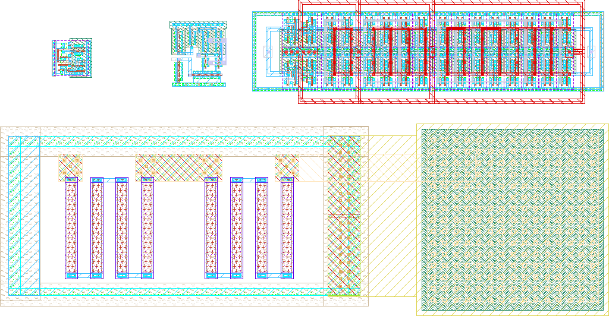
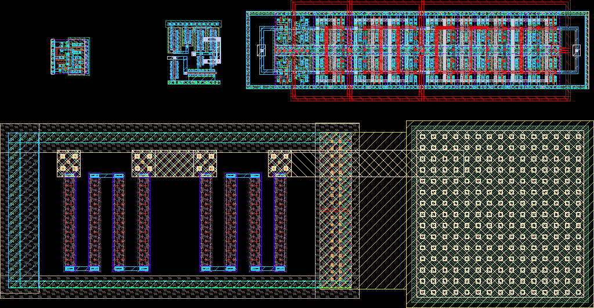

# QDLL

- Description: 100MHz Quadrature Delay Locked Loop for IHP SG13G2
- PDK: ihp-sg13g2

## Authorship

- Designer: Leonardo Vazquez, Martin Doric, Clemente Molinari, Santiago Basignana, Matias Schulthess, Mateo Buteler
- Company: Fundacion Fulgor
- Created: January 2026
- License: Apache 2.0
- Last modified: None

## Pins

- VDD
  + Description: Positive power supply
  + Direction: inout
  + Type: power
  + Vmin: 1.08
  + Vmax: 1.32
- VSS
  + Description: Ground supply
  + Direction: inout
  + Type: ground
- IN1
  + Description: Reference clock input 1
  + Direction: input
  + Type: signal
- IN2
  + Description: Reference clock input 2 (quadrature)
  + Direction: input
  + Type: signal
- OUT1
  + Description: Delayed clock output 1
  + Direction: output
  + Type: signal
- OUT2
  + Description: Delayed clock output 2 (quadrature)
  + Direction: output
  + Type: signal
- CP
  + Description: Charge pump / control voltage node
  + Direction: inout
  + Type: signal

## Default Conditions

- vdd
  + Description: Power supply voltage
  + Display: Vdd
  + Unit: V
  + Typical: 1.2
- temperature
  + Description: Ambient temperature
  + Display: Temp
  + Unit: °C
  + Typical: 27
- corner
  + Description: Process corner
  + Display: Corner
  + Typical: tt
- fin
  + Description: Input frequency
  + Display: Fin
  + Unit: MHz
  + Typical: 100
- cload
  + Description: Output load capacitance
  + Display: CLoad
  + Unit: fF
  + Typical: 100

## Symbol

## Schematic

## Layout

